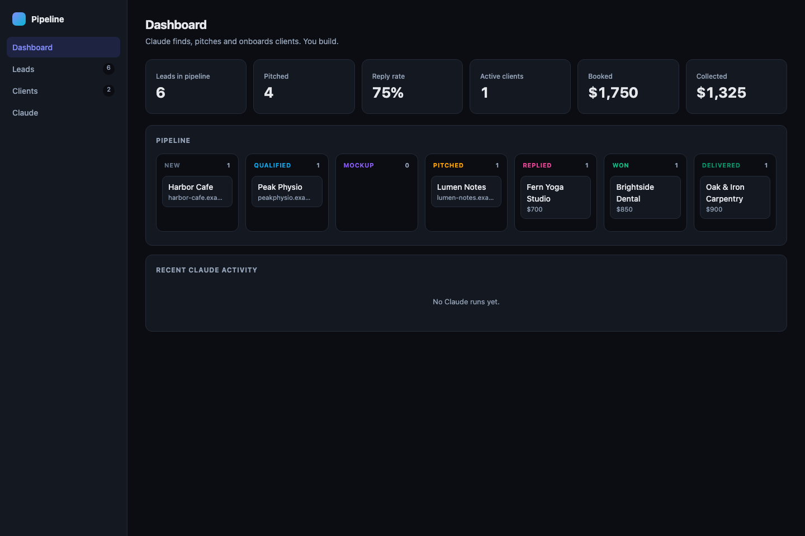
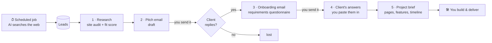
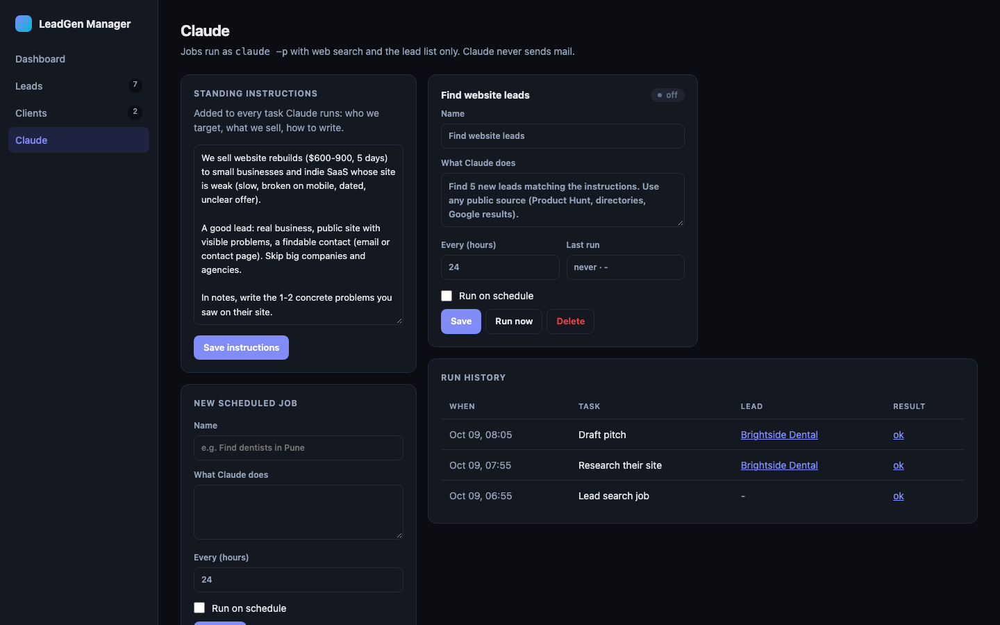
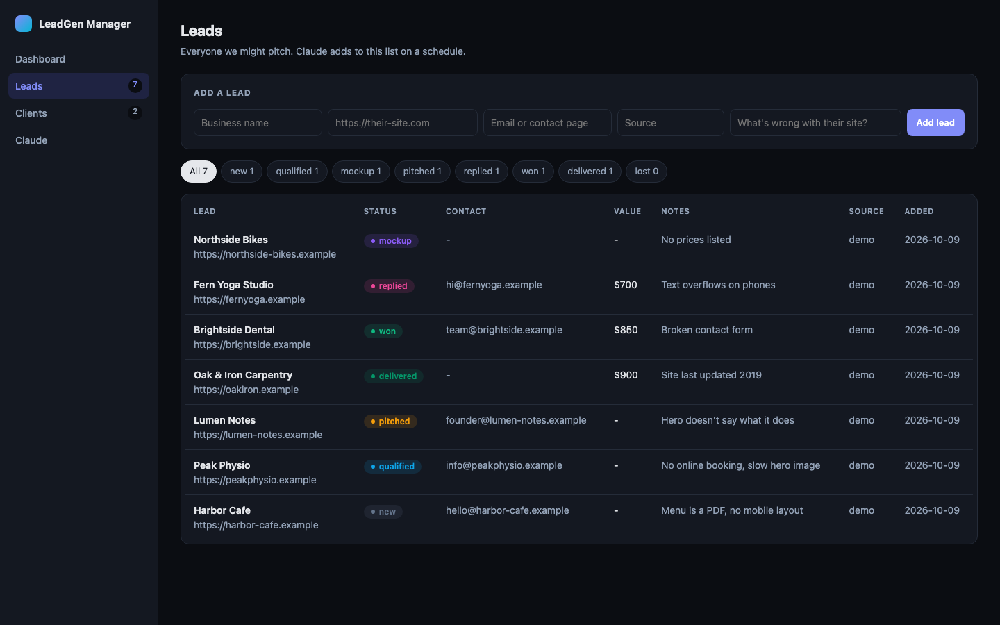
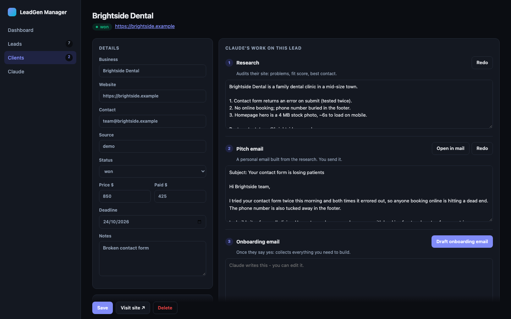
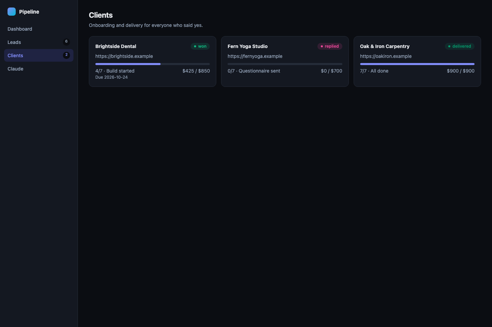

<div align="center">


# Lead Generation Manager

**A local CRM where AI finds, researches, pitches and onboards clients - and you do the work you're paid for.**

[](https://github.com/Hrishank21s/lead-generation-manager/actions/workflows/ci.yml)


[](LICENSE)
[](CONTRIBUTING.md)

[Features](#features) · [How it works](#how-it-works) · [Quick start](#quick-start) · [User guide](#user-guide) · [Configuration](#configuration) · [Security](#security) · [FAQ](#faq) · [Contributing](#contributing)



</div>

> [!WARNING]
> **Prototype - not a finished product.** This is an early working version (v0.1). It runs only on
> your own machine, has no login, and the data model may change between versions without migration.
> Try it, report issues, but don't run a business on it yet.

---

## Why

Freelancers and small agencies lose most of their week to the work *around* the work: finding
prospects, checking their websites, writing cold emails, chasing requirements. Lead Generation
Manager hands that to an AI agent running on **your own** Claude account, and keeps everything in one
local dashboard - while you stay in control of every message that goes out.

## Features

| | |
|---|---|
| 🔎 **Scheduled lead search** | Plain-English jobs ("find 5 dentists in Pune with outdated sites") run on an interval and add leads automatically, skipping duplicates. |
| 🧪 **Site research** | One click audits a prospect's website: what they sell, concrete problems with evidence, best contact, fit score. |
| ✉️ **Personal pitch drafts** | Short cold emails written from the research - not templates. |
| 🤝 **Client onboarding** | Drafts the requirements questionnaire, then turns the client's answers into a structured **project brief**. |
| 📋 **Pipeline & delivery** | Kanban board across 8 stages, a 7-step delivery checklist, price / paid / deadline tracking. |
| 🛡️ **You approve everything** | The AI never sends anything. Drafts open in your own mail app with one click. |
| 🪶 **Zero dependencies** | One Python file, standard library only, SQLite storage. Nothing to `pip install`. |

## How it works



**The split is deliberate:** the AI does searching, research and writing. **You** send every message,
talk to clients and do the build. Every AI step runs `claude -p` (Claude Code in headless mode) on your
machine with a locked-down tool list - see [Security](#security).

## Quick start

**Requirements**

- macOS or Linux (Windows via WSL) with **Python 3.11+**
- **[Claude Code](https://claude.com/claude-code)** installed and signed in - either a Claude
  subscription (Pro / Max) or an Anthropic API key. Check with `claude --version`.

**Run it**

```bash
git clone https://github.com/Hrishank21s/lead-generation-manager.git
cd lead-generation-manager
python3 leadgen.py serve
```

Open **http://127.0.0.1:8765**. On first start it creates `data/leadgen.db` with default
instructions and one lead-search job (switched **off**). Keep the server running for scheduled jobs.

## User guide

### 1 · Tell the AI about your business

**Claude → Standing instructions.** This text is added to every AI task. Describe what you sell, your
price, who you target, what makes a good lead, and how to sign emails.

```text
I build websites for physiotherapy clinics in Manchester, £900 fixed price, 7 days.
Good lead: independent clinic, site not mobile-friendly or no online booking, contact email visible.
Skip chains and franchises. Sign emails as "Sam, Northline Web".
```

### 2 · Find leads

**Claude → Jobs.** A job is a task in plain English plus an interval in hours.

- **Run now** - runs once (a few minutes). Results appear under *Run history* and in **Leads**.
- **Run on schedule** - repeats while the server is up.
- Add as many jobs as you like, e.g. one per city or niche.



You can also add leads by hand on the **Leads** page, or from the terminal (see [CLI](#cli)).



### 3 · Work a lead

Open any lead. The right panel is the AI's work, step by step:

| Step | Button | What the AI produces |
|:---:|---|---|
| 1 | **Research their site** | What they sell and to whom · 3 concrete site problems with evidence · best contact · fit score 1-5 |
| 2 | **Draft pitch** | A short, personal email quoting those problems and offering a free mockup |
| 3 | **Draft onboarding email** | Questions on goals, pages, copy, brand assets, reference sites, features, hosting, deadline, deposit |
| 4 | *(you)* | Paste the client's reply |
| 5 | **Write project brief** | Pages & sections · features · assets (have / missing) · design direction · timeline · price · open questions |

Every field is editable. Clicking a step saves the page, starts the AI, and the page refreshes itself
until the result arrives. **Open in mail** opens the draft in your mail app, addressed and ready.



### 4 · Track delivery

Set each lead's status as things happen:

`new` → `qualified` → `mockup` → `pitched` → `replied` → `won` → `delivered` (or `lost`)

Leads at *replied*, *won* or *delivered* move to **Clients**, with a 7-step checklist:
questionnaire sent → requirements received → brief approved → deposit paid → build started →
delivered → final payment received.



## Configuration

| Variable | Default | Purpose |
|---|---|---|
| `LEADGEN_DB` | `data/leadgen.db` | Database file location |
| `LEADGEN_CLAUDE` | `claude` | Path to the Claude Code CLI |
| `LEADGEN_MODEL` | *(your Claude Code default)* | Model passed as `--model`, e.g. `sonnet` or `opus` |

```bash
LEADGEN_MODEL=sonnet python3 leadgen.py serve 9000     # custom model and port
```

**Using an API key instead of a subscription:** set `ANTHROPIC_API_KEY` in the environment before
starting the server; Claude Code picks it up. AI usage is billed to your own account.

## CLI

```bash
python3 leadgen.py serve [port]          # start the dashboard (default 8765)
python3 leadgen.py add --name "Harbor Cafe" --url https://harbor-cafe.example \
    --contact hello@harbor-cafe.example --source manual --notes "menu is a PDF"
python3 leadgen.py list                  # all leads, tab-separated
python3 leadgen.py list pitched          # one status
```

## Security

- **Restricted AI.** Every run is `claude -p --permission-mode default` with an explicit allow-list.
  Lead-search jobs: web search, web fetch, `leadgen.py add` / `list`. Research: web search + fetch.
  Writing steps: no tools at all. Anything else is refused.
- **No sending.** There is no email code in this project; you send every message yourself.
- **Local only.** Binds to `127.0.0.1`; rejects requests with a foreign `Host` or `Origin`
  (CSRF / DNS-rebinding protection), so websites you visit can't trigger AI runs.
- **Escaped output, private data.** All page output is HTML-escaped; `data/` is git-ignored.

Details and how to report a vulnerability: [SECURITY.md](SECURITY.md).

## Project structure

```
leadgen.py            the whole app: server, UI, scheduler, AI runner, CLI
tests/                standard-library test suite (no AI calls)
docs/                 logo and screenshots
.github/              CI workflow and issue templates
```

Run the tests:

```bash
python3 -m unittest discover tests -v
```

## Roadmap

- [ ] Fixed-time schedules (e.g. "weekdays at 9:00")
- [ ] Inbox sync to detect replies and update status
- [ ] Client-facing requirements form
- [ ] Invoices and payment links
- [ ] CSV import / export
- [ ] Support for other AI providers

## FAQ

**Does it send emails for me?**
No, by design. It drafts; you review and send from your own mail app.

**What does it cost?**
The software is free to use. AI runs use your own Claude subscription or API credits - a lead-search
job is one Claude Code session of a few minutes.

**Is my data uploaded anywhere?**
Your leads stay in a local SQLite file. Text sent to the AI (instructions, lead details, client
replies) goes to Anthropic through Claude Code, under your account's terms.

**Can I use it for my business?**
Yes. It's MIT-licensed: use it, change it, ship it - just keep the copyright notice.

**Is it legal to cold-email leads?**
That depends on where you and your leads are (e.g. CAN-SPAM, GDPR, PECR). Write personal 1:1
emails, honour opt-outs, and check the rules that apply to you.

## Contributing

Contributions are welcome - bug reports, docs, and code. Read [CONTRIBUTING.md](CONTRIBUTING.md) to get
set up (no dependencies, tests run in under a second) and follow the [Code of Conduct](CODE_OF_CONDUCT.md).
Found a security issue? Please report it privately - see [SECURITY.md](SECURITY.md).

If this project is useful to you, a ⭐ helps others find it.

## License

[MIT](LICENSE) © 2026 Hrishank Soni

---

<div align="center"><sub>Built with Python's standard library and <a href="https://claude.com/claude-code">Claude Code</a>.</sub></div>
